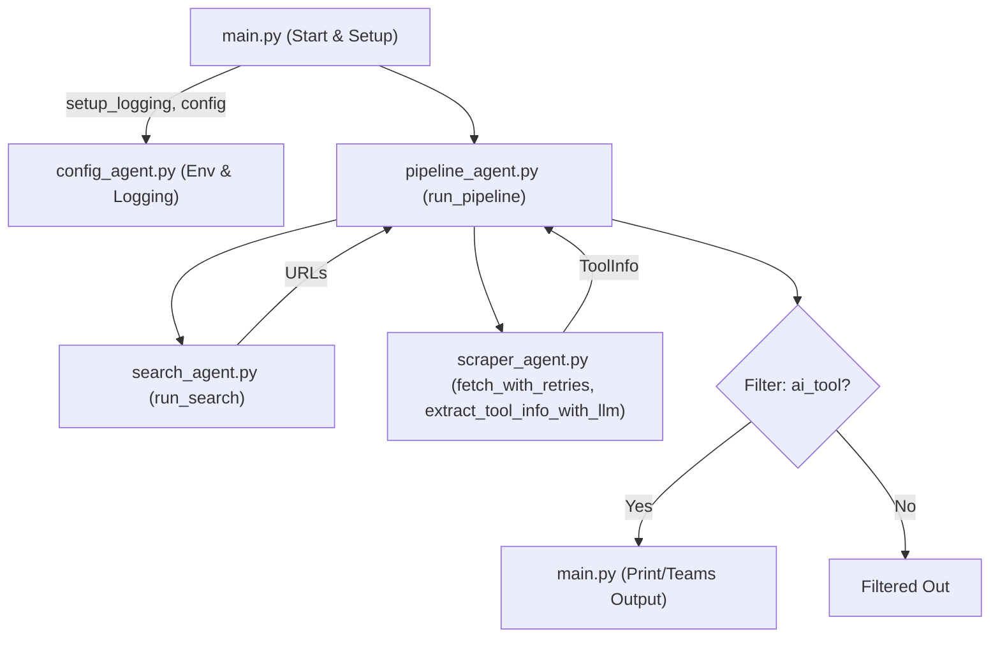
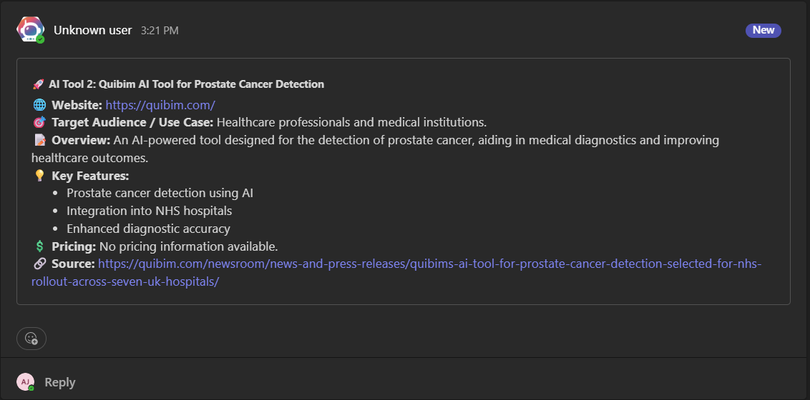

# AI Tool Discovery Agent

[](https://www.python.org/) 
[](LICENSE) 


---

> **Autonomously discover, summarize, and deliver the latest AI tools from the web, with robust async scraping, LLM enrichment, and Teams integration.**

---

## 📑 Table of Contents
- [🚀 Features](#-features)
- [⚡ Parallelism & Asynchronicity](#-parallelism--asynchronicity)
- [🏗️ Project Structure](#-project-structure)
- [🔄 Data Flow: How Tool Information is Processed](#-data-flow-how-tool-information-is-processed)
- [🗺️ Agent Interaction Flowchart](#-agent-interaction-flowchart)
- [➕ Extending the Agent](#-extending-the-agent)
- [📝 Setup](#-setup)

---

## 🚀 Features

✅ **Web Search**: Finds new AI tools from the last 7 days using Serper.dev and SerpApi, with strict date filtering on every query.  
✅ **Aggregator/News/Social Filtering**: Removes aggregator, news, video, and social domains before scraping, ensuring only genuine tool sites are processed.  
✅ **URL Normalization & Deduplication**: Normalizes and deduplicates URLs to avoid redundant processing.  
✅ **Async Batch HTML Fetching**: All HTTP requests are async and use a shared aiohttp session per batch for efficiency. Progress is shown with a tqdm progress bar. Batching is used for politeness and stability.  
✅ **Configurable Parallelism**: Batch size and LLM concurrency are configurable in `config/constants.py`.  
✅ **Robust robots.txt Caching**: Respects robots.txt and caches rules per domain for efficient, ethical scraping.  
✅ **Advanced LLM Extraction**: Uses Azure OpenAI GPT-4o with advanced prompt engineering for robust, information-dense extraction and classification. Only information present in the HTML/URL is used. Prompts are loaded from `prompts/system_prompt.txt` and `prompts/user_prompt.txt`.  
✅ **Dynamic ToolInfo Structure**: Uses a dataclass that supports dynamic enrichment by LLMs and additional fields.  
✅ **LLM-Based Tool Classification**: Uses Azure OpenAI to classify each result as an "AI tool" or "not an AI tool" before including it in the final output, ensuring high precision.  
✅ **Robust Error Handling & Logging**: Handles and logs errors for timeouts, SSL issues, and LLM extraction failures at every step. Aggregates and reports all errors at the end. Custom exceptions provide context. Domains that fail repeatedly are auto-blacklisted and persisted.  
✅ **Persistent Blacklist**: Domains that repeatedly fail are auto-blacklisted and stored in `data/blacklist.json` via `utils/blacklist.py`. The blacklist is loaded and updated automatically on each run.  
✅ **Summary Report**: Prints a summary of successes, failures, and skipped URLs after each run.  
✅ **Type Annotations & Docstrings**: All public functions have type hints and docstrings for maintainability and clarity.  
✅ **Teams Integration**: Results can be sent directly to a Microsoft Teams channel via webhook.  
✅ **Centralized Configuration**: All HTTP headers, search queries, batch sizes, and other constants are set in `config/constants.py` for easy maintenance.  
✅ **Testing Ready**: Includes tqdm for robust async testing.  

> **Note:**
> - The persistent blacklist is managed in `utils/blacklist.py` and stored in `data/blacklist.json`. It is auto-created and updated on each run.
> - Example output can be found in the `assets/` directory.

---

## ⚡ Parallelism & Asynchronicity

<table>
  <tr>
    <th style="text-align:left;">Step</th>
    <th>Async?</th>
    <th>Parallel?</th>
    <th>Throttled?</th>
    <th>Configurable?</th>
  </tr>
  <tr>
    <td><b>Search</b></td>
    <td>✅</td>
    <td>✅</td>
    <td>—</td>
    <td>—</td>
  </tr>
  <tr>
    <td><b>HTML Fetch</b></td>
    <td>✅</td>
    <td>✅ (per batch)</td>
    <td>✅ (by batch size)</td>
    <td>✅ (<code>BATCH_SIZE</code>)</td>
  </tr>
  <tr>
    <td><b>LLM Extraction</b></td>
    <td>✅</td>
    <td>✅</td>
    <td>✅ (semaphore)</td>
    <td>✅ (<code>LLM_CONCURRENCY_LIMIT</code>)</td>
  </tr>
  <tr>
    <td><b>Output</b></td>
    <td>—</td>
    <td>—</td>
    <td>—</td>
    <td>—</td>
  </tr>
</table>

- <b>Batching is used for HTML fetches</b> to avoid overwhelming target sites and to maintain stability. You can adjust <code>BATCH_SIZE</code> and <code>LLM_CONCURRENCY_LIMIT</code> in <code>config/constants.py</code> for your environment.
- <b>A shared <code>aiohttp.ClientSession</code></b> is used for all fetches in a batch for efficiency.
- <b>Progress bars</b> (via <code>tqdm</code>) are shown for both HTML fetching and LLM extraction.

---

## 🏗️ Project Structure

```text
AI_Agent-Weekly-Discovery/
├── main.py                # Entry point: CLI, logging, prints and sends results
├── agents/
│   ├── pipeline_agent.py  # Orchestrates the workflow: search → fetch → extract → LLM → classify
│   ├── search_agent.py    # All web search logic (Serper, SerpApi, query construction, aggregator filtering)
│   ├── scraper_agent.py   # Robust async HTML fetching, LLM extraction
│   └── config_agent.py    # Loads env vars, API keys, sets up logging
├── prompts/               # Prompt templates for LLMs
│   ├── system_prompt.txt
│   └── user_prompt.txt
├── utils/                 # Utility/helper functions (prompt loader, error handling, robots.txt cache, blacklist, etc.)
│   ├── prompt_loader.py
│   ├── error_handling.py
│   └── blacklist.py
├── models/                # Shared data models
│   └── tool_info.py
├── output/                # Pluggable output modules (console, teams, etc.)
│   ├── console.py
│   └── teams.py
├── config/                # Constants and configuration (HTTP headers, search queries, batch sizes, etc.)
│   └── constants.py
├── data/                  # Persistent data (auto-created, e.g., blacklist.json)
│   └── blacklist.json
├── assets/                # Example output images, etc.
│   └── teams_output_example.png
├── requirements.txt       # Python dependencies
└── README.md              # This file
```

---

## 🔄 Data Flow: How Tool Information is Processed

1. **Environment Setup & Validation**
   - Loads environment variables from `.env` and validates all critical API keys (Azure OpenAI, Serper.dev, SerpApi).
   - Sets up project-wide logging.

2. **Search & Candidate URL Collection**
   - Queries Serper.dev and SerpApi for new AI tool announcements (last 7 days only, strict filtering).
   - Normalizes and deduplicates URLs. Filters out aggregator, news, social, and non-tool domains.
   - Output: List of unique, recent candidate tool URLs (web).

3. **Async Batch HTML Fetching**
   - HTML is fetched in batches asynchronously for efficiency, using a shared aiohttp session per batch.
   - Progress is shown with a tqdm progress bar.
   - robots.txt is checked and cached per domain for efficiency.
   - Output: Mapping of URL → HTML content.

4. **LLM-Based Extraction & Classification**
   - Uses advanced prompt engineering with Azure OpenAI GPT-4o to extract all fields (title, website, core functionality, features, pricing, target audience, tags, etc.) and classify as "ai_tool" or "not_ai_tool" in a single call.
   - Only information present in the HTML/URL is used (no hallucination). Output is always raw JSON.
   - Output: `ToolInfo` dataclass with all fields populated.

5. **Filtering & Output**
   - Only tools classified as `ai_tool` are included in the final results.
   - Results are printed and can be sent to a Microsoft Teams channel via webhook.
   - Example output can be found in the `assets/` directory.

6. **Error Handling & Reporting**
   - All errors (HTTP, connection, robots.txt, etc.) are logged and aggregated.
   - At the end, a summary report is printed: total, successes, failures, skipped URLs.
   - Custom exceptions provide context for errors. Domains that fail repeatedly are auto-blacklisted and persisted in `data/blacklist.json`.

> **Tip:**
> All major steps have robust error handling and logging for traceability. Data flows from web search → deduplication → async HTML fetch → LLM extraction/classification → output. Each step is modular, with clear responsibility and robust error handling. **7-day filtering is enforced at the search stage, so only recent tool launches are considered.**

---

## 🗺️ Agent Interaction Flowchart



---

## ➕ Extending the Agent
- Add new search engines or queries in `agents/search_agent.py`.
- Improve extraction logic or prompt engineering in `prompts/` and `agents/scraper_agent.py`.
- Adjust batch size, timeouts, or logging in `config/constants.py` or `agents/pipeline_agent.py`.
- <b>All constants (headers, batch size, concurrency, search queries, etc.) are easily configurable in <code>config/constants.py</code> for rapid tuning and experimentation.</b>
- Add CLI arguments, export options, or new output integrations (e.g., Slack, dashboards) in `main.py`.

---

## 📝 Setup
1. **Clone the repository**
   ```bash
   git clone https://github.com/aditj-optimus/AI_Agent-Weekly-Discovery.git
   cd AI_Agent-Weekly-Discovery
   ```
2. **Install dependencies**
   ```bash
   pip install -r requirements.txt
   ```
3. **Environment Variables**
   - Create a `.env` file and fill in your credentials:
     - `AZURE_OPENAI_ENDPOINT`: Your Azure OpenAI endpoint URL
     - `AZURE_OPENAI_KEY`: Your Azure OpenAI API key
     - `AZURE_OPENAI_DEPLOYMENT`: Your deployment name (e.g., `gpt-4o`)
     - `SERPER_API_KEY`: Your Serper.dev API key (for web search)
     - `SERPAPI_API_KEY`: Your SerpApi API key (for web search)
     - `TEAMS_WEBHOOK_URL`: (Optional) Microsoft Teams webhook URL for sending results to Teams
4. **Run the agent**
   ```bash
   python main.py
   ```

---

## 📦 Example Output: Microsoft Teams Integrations
This is an example of how the AI Tool Discovery Agent posts results to a Microsoft Teams channel:



---

## 👤 Author
- **Author:** Adit Jain  
- **Employee ID:** INT73  
- **Company:** Optimus Information Inc. (during internship June-July 2025)  
- **Repo:** [github.com/aditj-optimus/AI_Agent-Weekly-Discovery](https://github.com/aditj-optimus/AI_Agent-Weekly-Discovery)