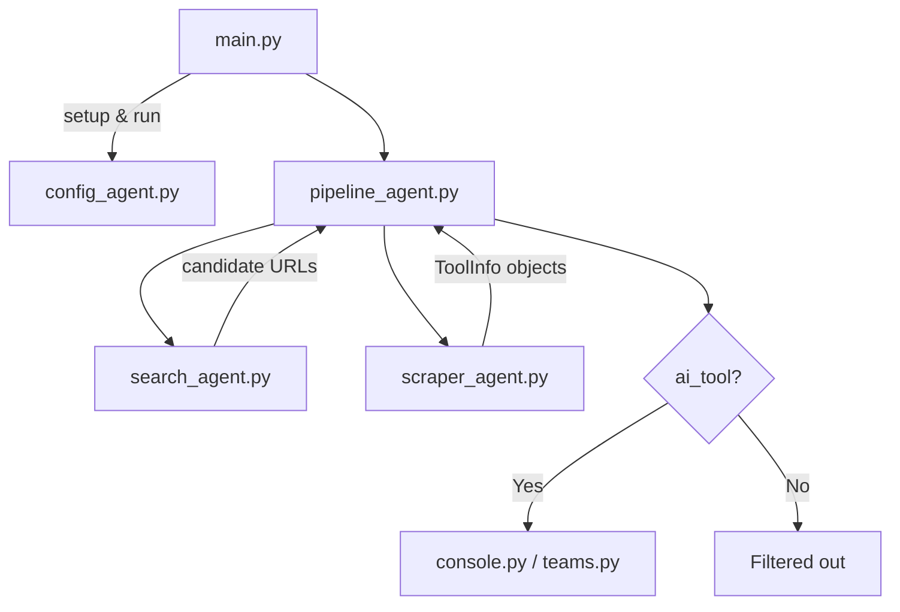
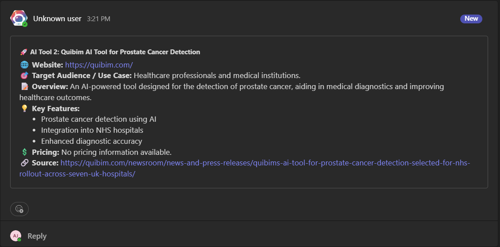

# AI Tool Discovery Agent

[](https://www.python.org/)
[](LICENSE)
[](https://github.com/psf/black)

An autonomous agent that discovers, summarizes, and delivers newly released AI tools from the open web. It combines multi-engine search, async web scraping, and GPT-4o-powered extraction into a single end-to-end pipeline — with optional Microsoft Teams delivery.

---

## Table of Contents

- [Key Features](#key-features)
- [Architecture](#architecture)
- [Project Structure](#project-structure)
- [Pipeline Overview](#pipeline-overview)
- [Parallelism & Concurrency](#parallelism--concurrency)
- [Getting Started](#getting-started)
- [Configuration](#configuration)
- [Extending the Agent](#extending-the-agent)
- [Example Output](#example-output)
- [Author](#author)

---

## Key Features

| Area | Details |
|---|---|
| **Multi-engine search** | Queries both Serper.dev and SerpApi in parallel with strict 7-day date filtering |
| **Smart filtering** | Removes aggregator, news, social, and non-tool domains before any scraping |
| **URL normalization** | Deduplicates URLs by stripping query params and fragments |
| **Async batch fetching** | Concurrent HTML retrieval via `aiohttp` with configurable batch size and progress bars |
| **robots.txt compliance** | Checks and caches robots.txt rules per domain |
| **LLM extraction** | Single GPT-4o call per page extracts title, summary, features, pricing, audience, tags, and classifies as AI tool vs. non-tool |
| **Persistent blacklist** | Auto-blacklists domains that repeatedly fail; persisted across runs in `data/blacklist.json` |
| **Error resilience** | Custom exception hierarchy, exponential backoff on transient errors, rate-limit retry for LLM calls |
| **Teams integration** | Formatted results posted directly to a Microsoft Teams channel via webhook |
| **Centralized config** | All tunable constants (headers, batch sizes, queries, aggregator list) live in `config/constants.py` |

---

## Architecture


```mermaid
graph TD
    A["main.py"] -->|setup & run| B["config_agent.py"]
    A --> C["pipeline_agent.py"]
    C --> D["search_agent.py"]
    D -->|candidate URLs| C
    C --> E["scraper_agent.py"]
    E -->|ToolInfo objects| C
    C --> F{"ai_tool?"}
    F -- Yes --> G["console.py / teams.py"]
    F -- No --> H["Filtered out"]
```

The system is organized into focused modules:

- **Agents** — orchestration (`pipeline_agent`), search (`search_agent`), scraping + LLM extraction (`scraper_agent`), configuration (`config_agent`)
- **Models** — `ToolInfo` dataclass for structured tool data
- **Output** — pluggable output targets (console, Teams)
- **Utils** — prompt loading, robots.txt checking, persistent blacklisting, custom exceptions
- **Config** — all constants and tunable parameters

---

## Project Structure

```text
AI_Agent-Weekly-Discovery/
├── main.py                    # Entry point: setup, pipeline execution, output
├── agents/
│   ├── config_agent.py        # Environment loading, API key validation, logging
│   ├── pipeline_agent.py      # Orchestrates search → fetch → extract → filter
│   ├── scraper_agent.py       # Async HTML fetching, LLM extraction (GPT-4o)
│   └── search_agent.py        # Multi-engine search (Serper, SerpApi), filtering
├── config/
│   └── constants.py           # HTTP headers, batch sizes, queries, aggregator list
├── models/
│   └── tool_info.py           # ToolInfo dataclass
├── output/
│   ├── console.py             # Terminal output formatting
│   └── teams.py               # Microsoft Teams webhook integration
├── prompts/
│   ├── system_prompt.txt      # LLM system prompt template
│   └── user_prompt.txt        # LLM user prompt template with JSON schema
├── utils/
│   ├── blacklist.py           # Persistent domain blacklist
│   ├── error_handling.py      # Custom exception classes
│   └── prompt_loader.py       # Prompt file loading, robots.txt checking
├── data/                      # Auto-created runtime data
│   └── blacklist.json         # Persisted blacklist (auto-generated)
├── assets/
│   └── teams_output_example.png
├── requirements.txt
├── LICENSE
└── README.md
```

---

## Pipeline Overview

```text
┌─────────────────────────────────────────────────────────┐
│  1. Setup          Load .env, validate API keys,        │
│                    configure logging                    │
├─────────────────────────────────────────────────────────┤
│  2. Search         Query Serper + SerpApi in parallel   │
│                    → normalize & deduplicate URLs       │
│                    → filter aggregator domains          │
├─────────────────────────────────────────────────────────┤
│  3. Fetch          Async batch HTML retrieval           │
│                    → robots.txt compliance              │
│                    → retry with exponential backoff     │
├─────────────────────────────────────────────────────────┤
│  4. Extract        GPT-4o extracts structured fields    │
│                    + classifies as ai_tool / not_ai_tool│
│                    (throttled, parallel, with retry)    │
├─────────────────────────────────────────────────────────┤
│  5. Filter         Keep ai_tool only → deduplicate      │
│                    → enforce 7-day recency              │
├─────────────────────────────────────────────────────────┤
│  6. Output         Console summary + Teams webhook      │
│                    + error/blacklist report             │
└─────────────────────────────────────────────────────────┘
```

---

## Parallelism & Concurrency

| Step | Async | Parallel | Throttled | Configurable |
|---|:---:|:---:|:---:|:---:|
| **Search** | Yes | Yes (both engines) | — | — |
| **HTML Fetch** | Yes | Yes (per batch) | By batch size | `BATCH_SIZE` |
| **LLM Extraction** | Yes | Yes (semaphore) | By concurrency limit | `LLM_CONCURRENCY_LIMIT` |
| **Output** | — | — | — | — |

- HTML fetches use a **shared `aiohttp.ClientSession`** per pipeline run for connection reuse.
- LLM calls run in parallel with an **asyncio semaphore** to stay within rate limits.
- Progress is displayed via **tqdm** progress bars for both fetch and extraction phases.

---

## Getting Started

### Prerequisites

- Python 3.10 or higher
- API keys for Azure OpenAI, Serper.dev, and SerpApi

### Installation

```bash
git clone https://github.com/aditj-optimus/AI_Agent-Weekly-Discovery.git
cd AI_Agent-Weekly-Discovery
python -m venv .venv
source .venv/bin/activate  # Windows: .venv\Scripts\activate
pip install -r requirements.txt
```

### Environment Variables

Create a `.env` file in the project root:

```env
AZURE_OPENAI_ENDPOINT=https://your-resource.openai.azure.com/
AZURE_OPENAI_KEY=your-azure-openai-key
AZURE_OPENAI_DEPLOYMENT=gpt-4o

SERPER_API_KEY=your-serper-api-key
SERPAPI_API_KEY=your-serpapi-api-key

# Optional
TEAMS_WEBHOOK_URL=https://your-teams-webhook-url
```

### Run

```bash
python main.py
```

---

## Configuration

All tunable parameters are in [`config/constants.py`](config/constants.py):

| Constant | Default | Description |
|---|---|---|
| `LLM_INPUT_TRUNCATION_LIMIT` | `15,000` | Max HTML characters sent to GPT-4o per page |
| `BATCH_SIZE` | `4` | Number of concurrent HTTP fetches per batch |
| `LLM_CONCURRENCY_LIMIT` | `2` | Max concurrent LLM extraction calls |
| `AGGREGATOR_DOMAINS` | ~80 domains | Domains filtered out before scraping |
| `BASE_QUERIES` | 6 queries | Search query templates (date suffix added automatically) |
| `NON_RETRYABLE_STATUS_CODES` | `{403, 404}` | HTTP codes that skip retry and record blacklist failure |

---

## Extending the Agent

- **Add search engines** — Implement a new `search_web_for_*` function in `agents/search_agent.py` and wire it into `run_search()`.
- **Improve extraction** — Edit the prompt templates in `prompts/` or adjust temperature/max_tokens in `scraper_agent.py`.
- **Add output targets** — Create a new module in `output/` (e.g., `slack.py`, `email.py`) and call it from `main.py`.
- **Tune performance** — Adjust `BATCH_SIZE` and `LLM_CONCURRENCY_LIMIT` in `config/constants.py`.
- **Add CLI arguments** — Extend `main.py` with `argparse` for runtime configuration.

---

## Example Output

### Microsoft Teams Integration



---

## Author

**Adit Jain**
Developed during internship at Optimus Information Inc. (June–July 2025)

[GitHub Repository](https://github.com/aditj-optimus/AI_Agent-Weekly-Discovery)
